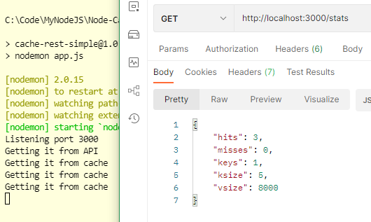

# Node Cache

## Commands

```dos
npm init -y
npm i -S express
npm i -S node-cache
npm i -S node-fetch
npm i -D nodemon
npm run dev
```

```json
"type":"module",
"dev": "nodemon app.js"
```

http://localhost:3000/

## Node cache vs Node Redis

Redis is better?

##

Package.json

```json

```

```javascript
import fetch from "node-fetch";
import NodeCache from "node-cache";
import express from "express";
```

vs

```javascript
const NodeCache = require("node-cache");
const express = require("express");
```

## Screenshot



