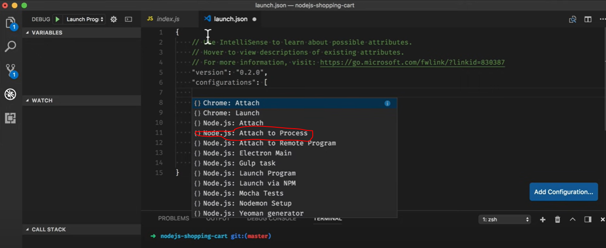
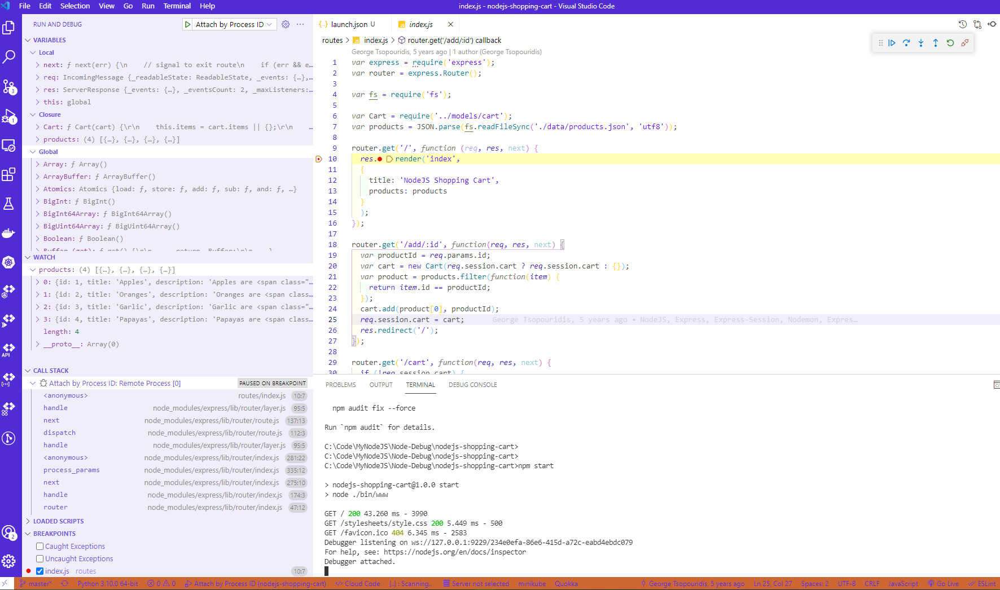
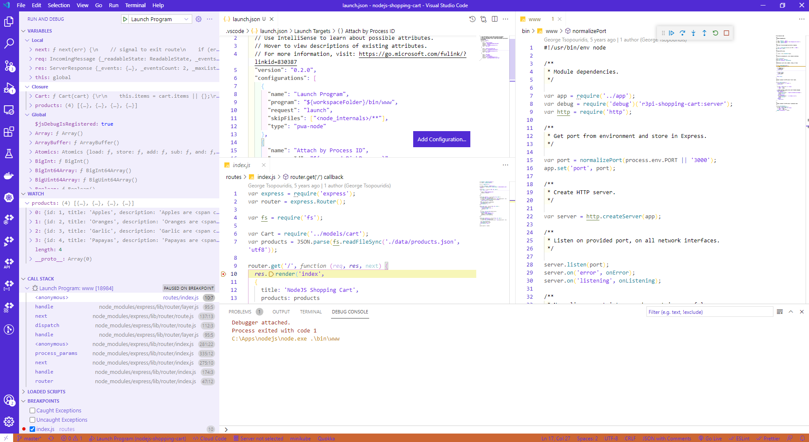

# Node debug in VSCode

## Commands

```dos
git clone https://github.com/gtsopour/nodejs-shopping-cart
npm start
```

## Debug running Node.js processes with VS Code





```dos
    {
      "name": "Attach by Process ID",
      "processId": "${command:PickProcess}",
      "request": "attach",
      "skipFiles": ["<node_internals>/**"],
      "type": "pwa-node"
    },
```

## Launch Node.js processes from VS Code

```dos
    {
      "name": "Launch Program",
      "program": "${workspaceFolder}/app.js",
      "request": "launch",
      "skipFiles": ["<node_internals>/**"],
      "type": "pwa-node"
    },
```

->

```dos
    {
      "name": "Launch Program",
      "program": "${workspaceFolder}/bin/www",
      "request": "launch",
      "skipFiles": ["<node_internals>/**"],
      "type": "pwa-node"
    },
```

This /bin/www needs to be manually created.

Note the "Debugger attached".


