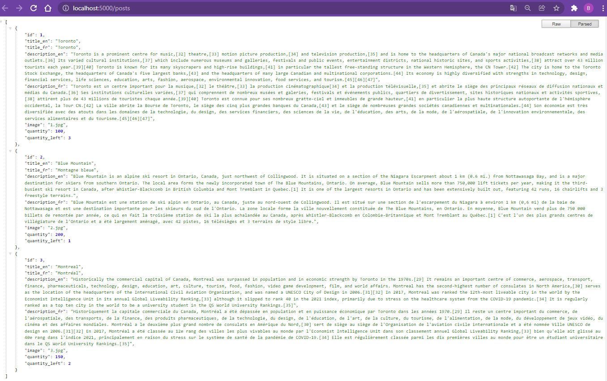

# Node UUID

## Commands

```dos
npm init -y
npm i -S express cors
npm i -D nodemon
npm start
```

## Screenshot



## Cors

```javascript
app.use(
  cors({
    origin: "*",
  })
);
```

## Module.Exports

```javascript
const posts = [
  { title: 1, description: "Course 1" },
  { title: 2, description: "Course 2" },
  { title: 3, description: "Course 3" },
];

module.exports = posts;
```

```javascript
const posts = require("./posts");
```

## JSON Formatter - Chrome JSON Extension
