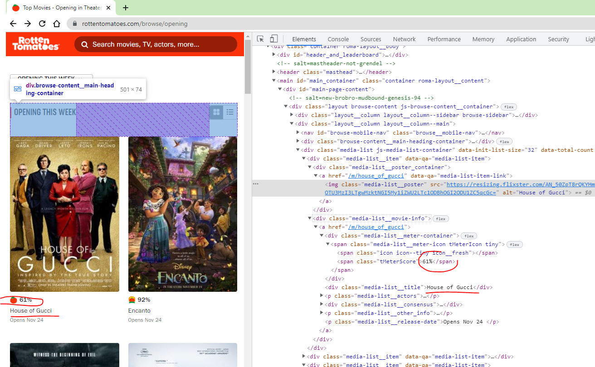
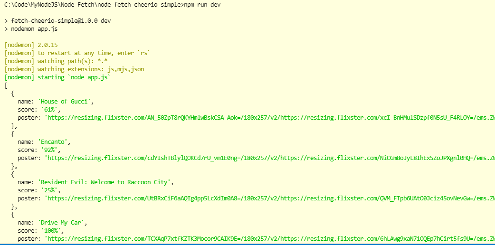

# Node Cache

## Commands

```dos
npm init -y
npm i -S node-fetch
npm i -S cheerio
npm i -D nodemon
npm run dev
```

```json
"type": "module",
"dev": "nodemon app.js"
```

## import?

Why someone did like this?

```javascript
const fetch = require("node-fetch");
const cheerio = require("cheerio");
```

I have to use the following -

```javascript
import fetch from "node-fetch";
import cheerio from "cheerio";
```

## Screenshot




