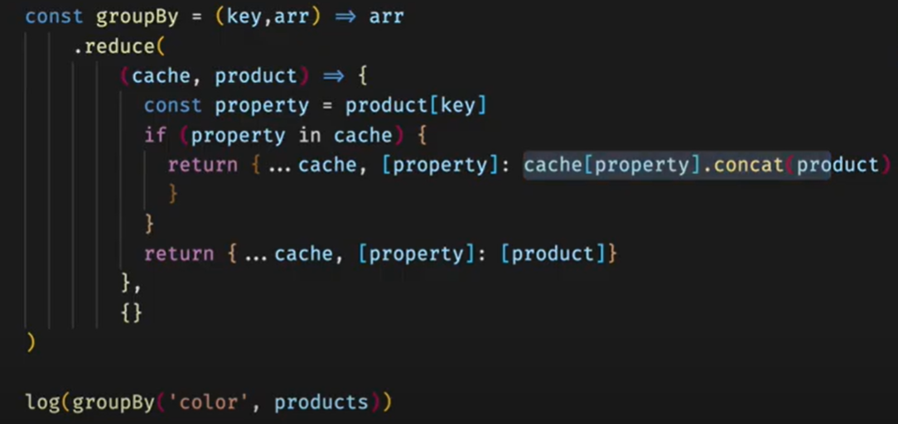
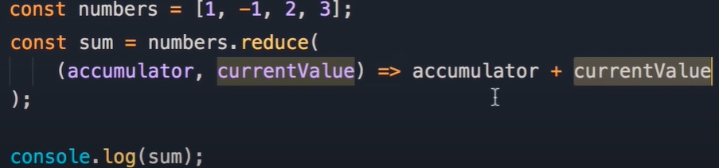

# Node Loadsh GroupBy

## lodash groupBy doc

## Commands

```dos
.eslint.yml
.prettierrc.yml
```

```dos
npm init -y
npm i lodash
npm i -S nodemon eslint prettier
npm init @eslint/config
nodemon app.js
```

```dos
C:\Code\MyNodeJS\Node-Lodash\lodash-groupby>npm init @eslint/config
Need to install the following packages:
  @eslint/create-config
Ok to proceed? (y) y
? How would you like to use ESLint? ...
  To check syntax only
> To check syntax and find problems
  To check syntax, find problems, and enforce code style
√ How would you like to use ESLint? · problems
√ What type of modules does your project use? · esm
√ Which framework does your project use? · none
√ Does your project use TypeScript? · No / Yes
√ Where does your code run? · browser
√ What format do you want your config file to be in? · JavaScript
Local ESLint installation not found.
The config that you've selected requires the following dependencies:

eslint@latest
√ Would you like to install them now with npm? · No / Yes
Installing eslint@latest
npm WARN idealTree Removing dependencies.eslint in favor of devDependencies.eslint

up to date, audited 189 packages in 2s

26 packages are looking for funding
  run `npm fund` for details

found 0 vulnerabilities
A config file was generated, but the config file itself may not follow your linting rules.
Successfully created .eslintrc.js file in C:\Code\MyNodeJS\Node-Lodash\lodash-groupby
```

## Output

```javascript
const array = [
  { id: 1, marks: 90, name: 'a' },
  { id: 2, marks: 70, name: 'b' },
  { id: 3, marks: 90, name: 'c' },
  { id: 4, marks: 90, name: 'd' },
  { id: 5, marks: 80, name: 'e' },
];

const output = _.groupBy(array, 'marks');

console.log('Output of groupBy is: ', output);
```

```dos
Output of groupBy is:  {
  '70': [ { id: 2, marks: 70, name: 'b' } ],
  '80': [ { id: 5, marks: 80, name: 'e' } ],
  '90': [
    { id: 1, marks: 90, name: 'a' },
    { id: 3, marks: 90, name: 'c' },
    { id: 4, marks: 90, name: 'd' }
  ]
}
```

## Loadsh \_.map() vs ES6 [].map()

## Other useful lodash functions

times

omit

compact

difference

## With Reduce




