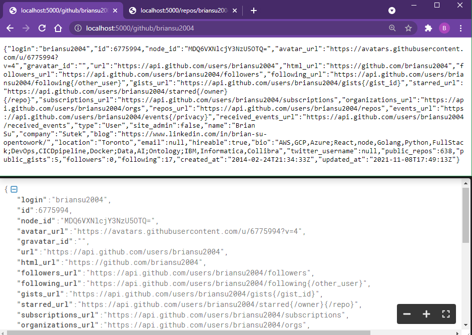
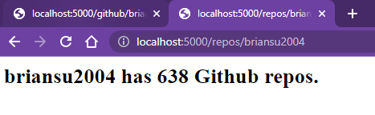
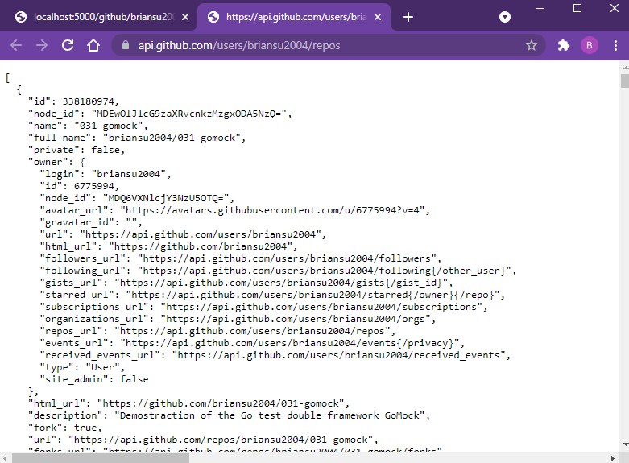

# Node Redis

## Commands

```dos
npm init -y
npm i -S redis
npm i -S node-fetch
npm i -S express
npm i -D nodemon
npm i -D redis-cli
"dev": "nodemon app.js"
npm run dev
```

http://localhost:5000

http://localhost:5000/github/briansu2004

http://localhost:5000/repos/briansu2004

## My GitHub record (as of Nov 29, 2021)

```json
{
  "login": "briansu2004",
  "id": 6775994,
  "node_id": "MDQ6VXNlcjY3NzU5OTQ=",
  "avatar_url": "https://avatars.githubusercontent.com/u/6775994?v=4",
  "gravatar_id": "",
  "url": "https://api.github.com/users/briansu2004",
  "html_url": "https://github.com/briansu2004",
  "followers_url": "https://api.github.com/users/briansu2004/followers",
  "following_url": "https://api.github.com/users/briansu2004/following{/other_user}",
  "gists_url": "https://api.github.com/users/briansu2004/gists{/gist_id}",
  "starred_url": "https://api.github.com/users/briansu2004/starred{/owner}{/repo}",
  "subscriptions_url": "https://api.github.com/users/briansu2004/subscriptions",
  "organizations_url": "https://api.github.com/users/briansu2004/orgs",
  "repos_url": "https://api.github.com/users/briansu2004/repos",
  "events_url": "https://api.github.com/users/briansu2004/events{/privacy}",
  "received_events_url": "https://api.github.com/users/briansu2004/received_events",
  "type": "User",
  "site_admin": false,
  "name": "Brian Su",
  "company": "Sutek",
  "blog": "https://www.linkedin.com/in/brian-su-opentowork/",
  "location": "Toronto",
  "email": null,
  "hireable": true,
  "bio": "AWS,GCP,Azure;React,node,Golang,Python,FullStack;DevOps,CICDpipeline,Docker;Data,AI;Ontology;IBM,Informatica,Collibra",
  "twitter_username": null,
  "public_repos": 638,
  "public_gists": 5,
  "followers": 0,
  "following": 17,
  "created_at": "2014-02-24T21:34:33Z",
  "updated_at": "2021-11-08T17:49:13Z"
}
```

Note:

Markdown can auto-reformat the raw json data!

## Screenshot






