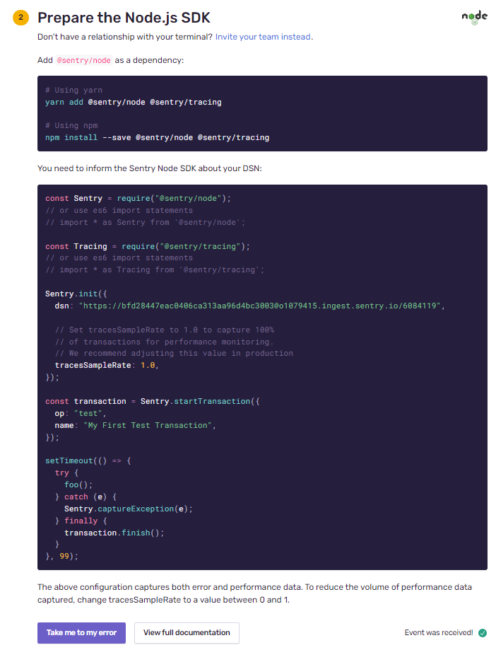
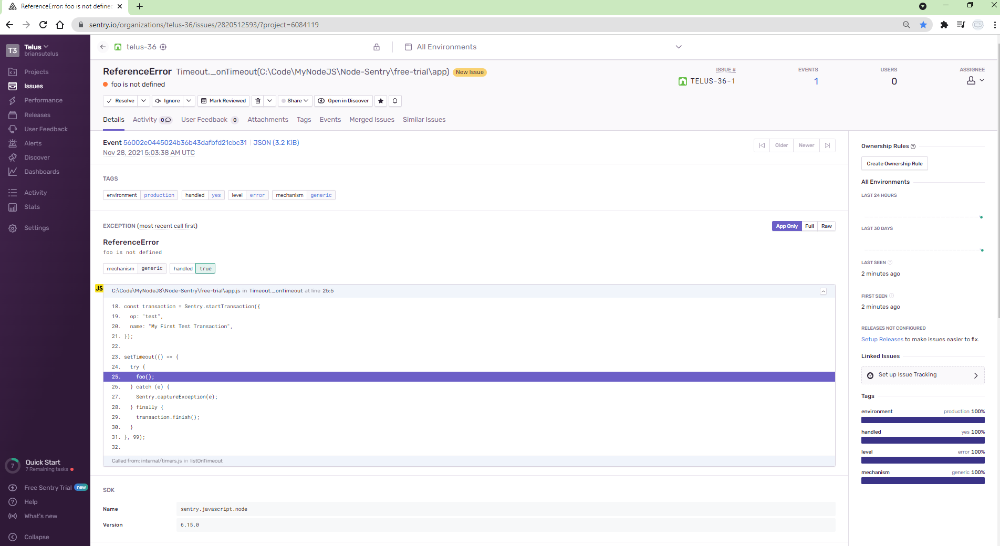
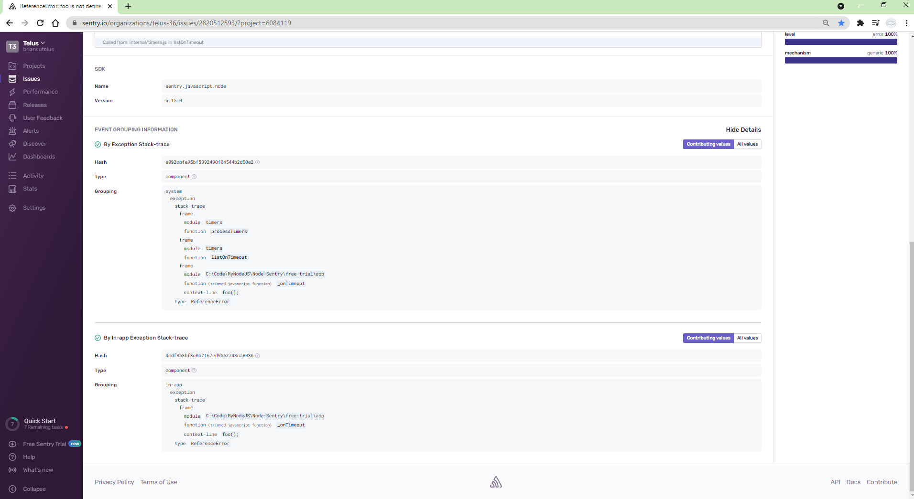

# Node Sentry

## Commands

### Add @sentry/node as a dependency:

```dos
npm install --save @sentry/node @sentry/tracing
```

### Inform the Sentry Node SDK about your DSN:

```javascript
const Sentry = require("@sentry/node");
// or use es6 import statements
// import * as Sentry from '@sentry/node';

const Tracing = require("@sentry/tracing");
// or use es6 import statements
// import * as Tracing from '@sentry/tracing';

Sentry.init({
  dsn: "https://bfd28447eac0406ca313aa96d4bc3003@o1079415.ingest.sentry.io/6084119",

  // Set tracesSampleRate to 1.0 to capture 100%
  // of transactions for performance monitoring.
  // We recommend adjusting this value in production
  tracesSampleRate: 1.0,
});

const transaction = Sentry.startTransaction({
  op: "test",
  name: "My First Test Transaction",
});

setTimeout(() => {
  try {
    foo();
  } catch (e) {
    Sentry.captureException(e);
  } finally {
    transaction.finish();
  }
}, 99);
```

## Screenshot








