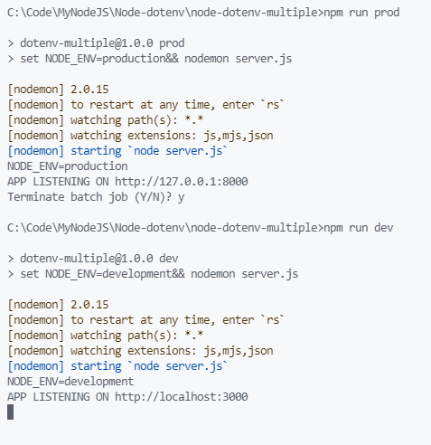

# Node dotenv

## Commands

```dos
npm init -y
npm i -S dotenv express
npm i -D nodemon
npm i -D cross-env
npm run dev
```

```dos
set NODE_ENV=production&& nodemon server.js
```

works.

```dos
set NODE_ENV=production&&nodemon server.js
```

works.

```dos
set NODE_ENV=production && nodemon server.js
```

doesn't work :-)

## Screenshot



```dos
C:\Code\MyNodeJS\Node-dotenv\node-dotenv-multiple>npm run prod

> dotenv-multiple@1.0.0 prod
> set NODE_ENV=production&& nodemon server.js

[nodemon] 2.0.15
[nodemon] to restart at any time, enter `rs`
[nodemon] watching path(s): *.*
[nodemon] watching extensions: js,mjs,json
[nodemon] starting `node server.js`
NODE_ENV=production
APP LISTENING ON http://127.0.0.1:8000
Terminate batch job (Y/N)? y

C:\Code\MyNodeJS\Node-dotenv\node-dotenv-multiple>npm run dev

> dotenv-multiple@1.0.0 dev
> set NODE_ENV=development&& nodemon server.js

[nodemon] 2.0.15
[nodemon] to restart at any time, enter `rs`
[nodemon] watching path(s): *.*
[nodemon] watching extensions: js,mjs,json
[nodemon] starting `node server.js`
NODE_ENV=development
APP LISTENING ON http://localhost:3000
```

## NODE_ENV in Windows

Powershell

```dos
$env:NODE_ENV="production"
```

CMD

```dos
set NODE_ENV=production
```

cross-env

```dos
cross-env NODE_ENV=production my-command
```
