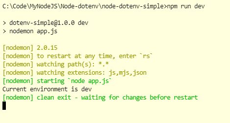

# Node dotenv

## Commands

```dos
npm init -y
npm i -D nodemon
npm i -D dotenv
npm run dev
```

## Simple syntax

```javascript
require("dotenv").config();

console.log("Current environment is " + process.env.ENV);
```

## Screenshot



```dos
C:\Code\MyNodeJS\Node-dotenv\node-dotenv-simple>npm run dev

> dotenv-simple@1.0.0 dev
> nodemon app.js

[nodemon] 2.0.15
[nodemon] to restart at any time, enter `rs`
[nodemon] watching path(s): *.*
[nodemon] watching extensions: js,mjs,json
[nodemon] starting `node app.js`
Current environment is dev
[nodemon] clean exit - waiting for changes before restart
```

## Require -> Import

```javascript
require("dotenv").config();
```

==>

```javascript
import dotenv from "dotenv";
dotenv.config();
```
