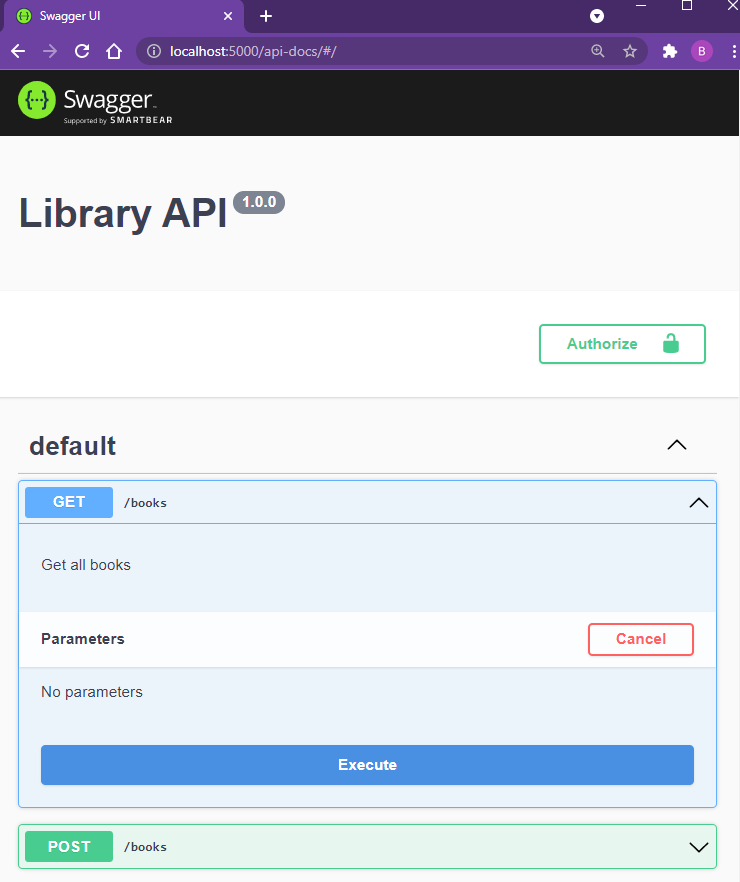
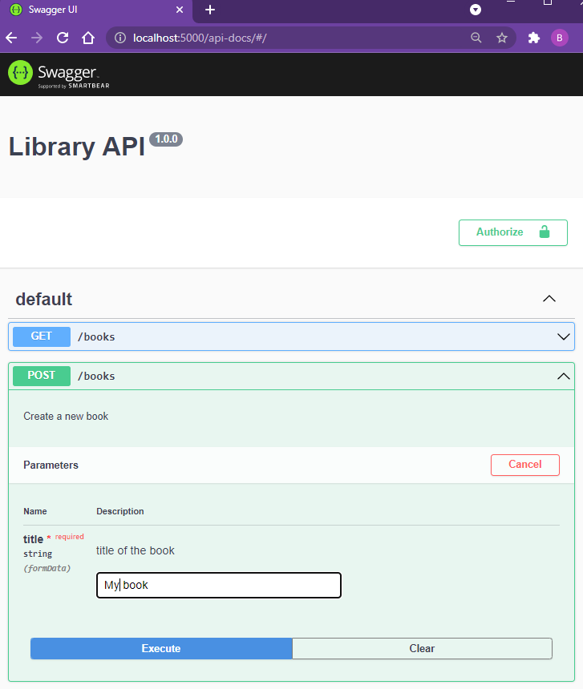
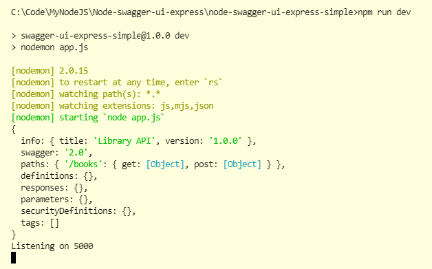

# Node Swagger UI Express

## Commands

```dos
npm init -y
npm i -S swagger-ui-express
npm i -S swagger-jsdoc
npm i -S express
npm i -D nodemon
npm run dev
```

http://localhost:3000/

## Screenshot






